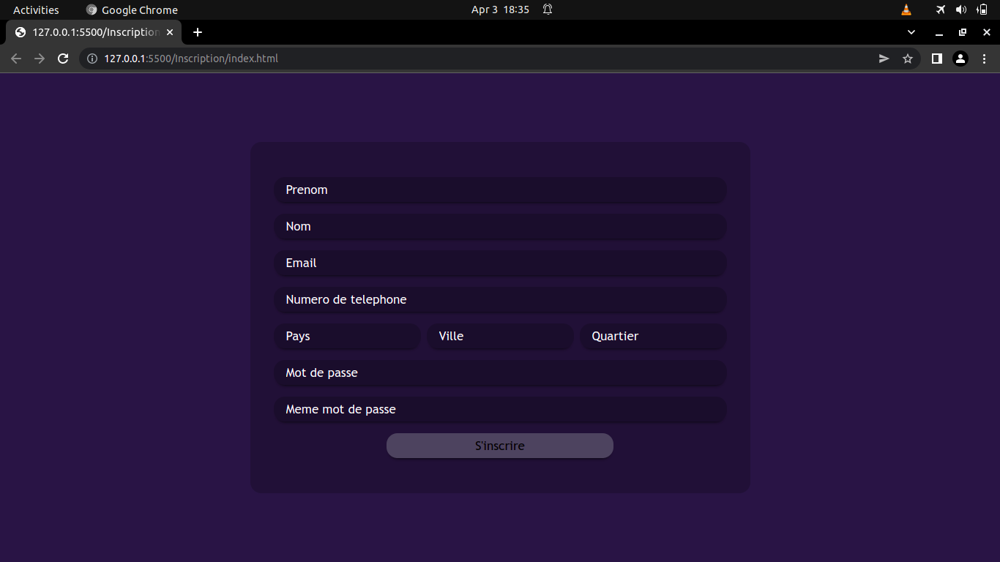
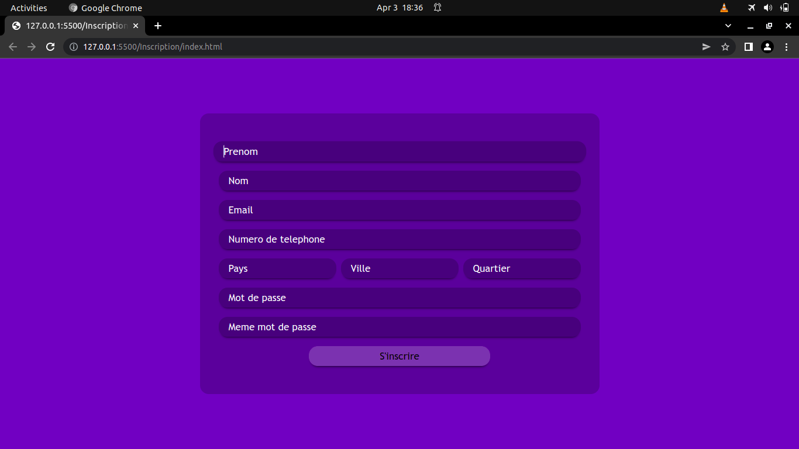
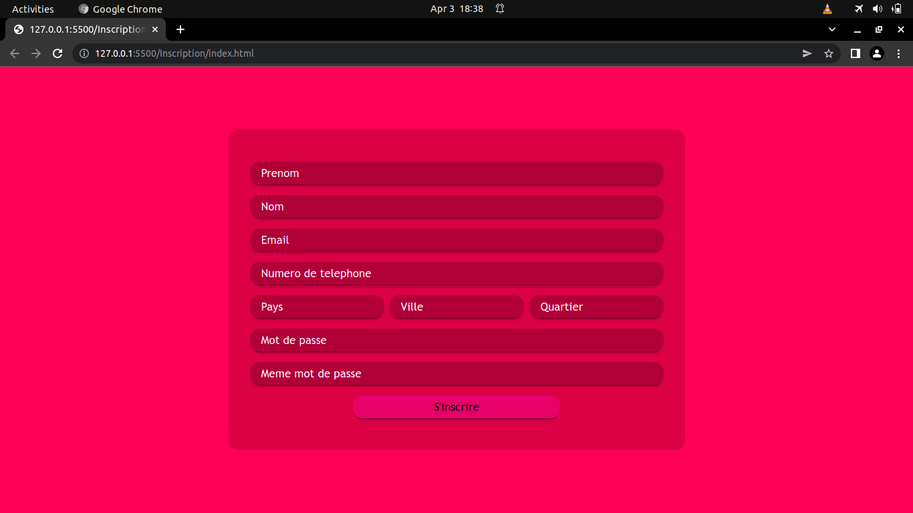
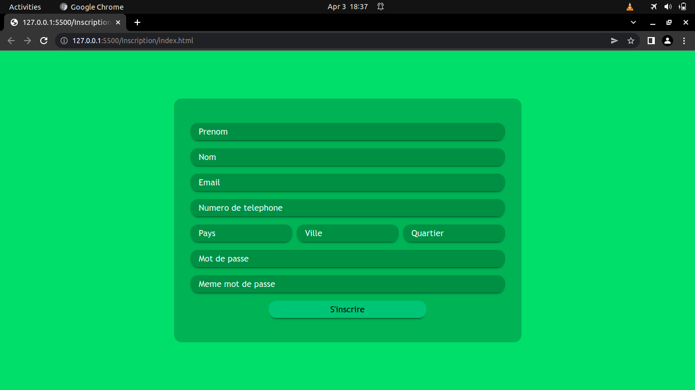
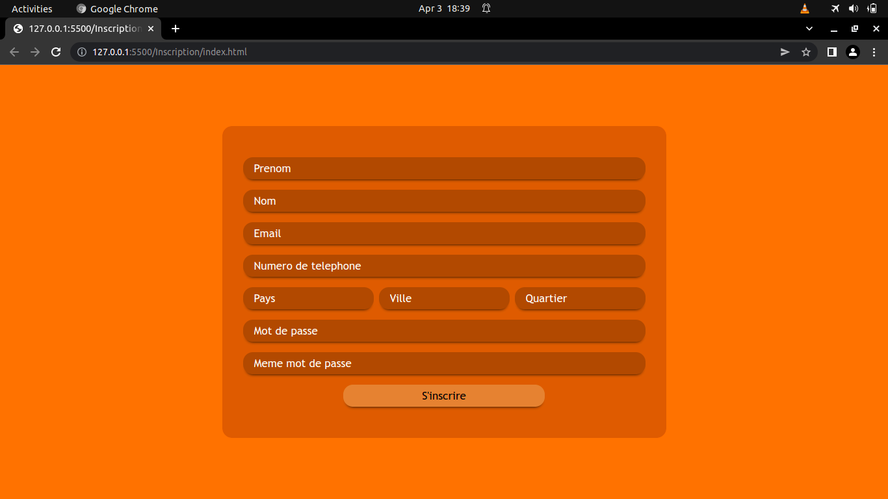

# Authentication_page

Login and Registration page.
Just HTML, CSS and JS.

Icons: https://icons.getbootstrap.com/

On Linux wiht Apache, open server by running:

$ php -S localhost:`PORT`(exemple: php -S localhost:8000)

If you are using vscode just install live serveur plugins and start the serveur(jsute click on Go live button)

## DARK background

## BLUE background

## RED background

## GREEN background

## YELLOW background

